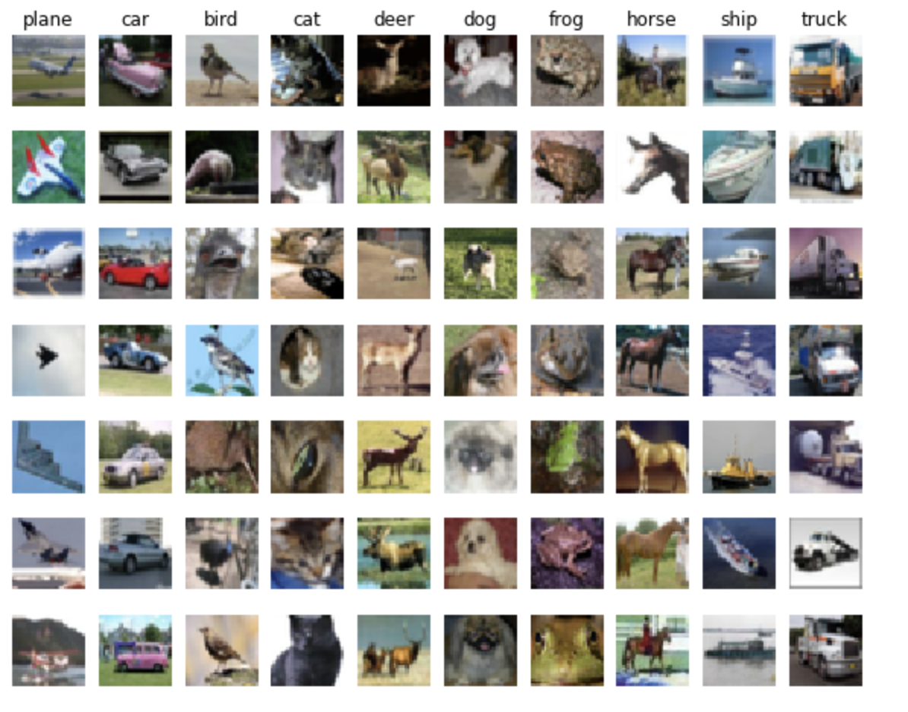

## Assignment 2022

### Assignment 0: Python Numpy

[Python Tutorial](../2022Assignment/assignment0/python.ipynb)

- Jupyter and Colab Notebooks
- Python

  - Basic data types, Containers(Lists, Dictionaries, Sets, Tuples)
  - Functions
  - Classes
- Numpy

  - Arrays
  - Array indexing (**Boolean/ Integer Array Indexing**)
  - Datatypes
  - Array math
  - Broadcasting
- SciPy

  - Image operations
  - MATLAB files
  - Distance between points
- Matplotlib

  - Plotting, Subplots, Images

## Assignment 1: Neural Networks

## Image Classification Pipeline

Data-driven approach (train/predict stages)

The CIFAR-10 dataset: 32x32 resolution RGB colour images in 10 classes, with 6000 images per class. There are 50000 training images and 10000 test images.


```
Training data shape:  (50000, 32, 32, 3) 
Training labels shape:  (50000,) 
```

### k-Nearest Neighbor (kNN)

Q1: [k-Nearest Neighbor classifier](../2022Assignment/assignment1/knn.ipynb)

Training: the classifier takes the training data and simply remembers it.

Testing: kNN classifies every test image by comparing to all training images and transferring the labels of the k most similar training examples.

Compute the distance between each test point in X and each training point
in self.X_train using a (nested) loop over both the training data and the
test data.

Distance Matrics, L1, L2 distances, np.linalg.norm()

Cross-validation: the value of k is cross-validated


## Linear Classifier: parametric approach

Preprocessing: Reshape into single row; Normalization, center, scale; Add bias dimension term

Implement a fully-vectorized loss function, analytic gradient expression

Validation set to tune the learning rate and regularization strength

Optimize the loss function with SGD

Visualize the final learned weights

### SVM

[Q2: Training a Support Vector Machine](../2022Assignment/assignment1/svm.ipynb)

Loss Function: max-margin loss

Analytic gradient: exact, fast, error-prone

Gradient Check: using easy-to-write Numerical gradient to make sure everything is right.


### Softmax

[Q3: Implement a Softmax classifier](../2022Assignment/assignment1/softmax.ipynb)

Loss Function: cross-entropy

### Two-Layer Neural Network

[Q4: Two-Layer Neural Network](../2022Assignment/assignment1/two_layer_net.ipynb)

## Image Features

[Q5: Higher Level Representations: Image Features](../2022Assignment/assignment1/features.ipynb)
