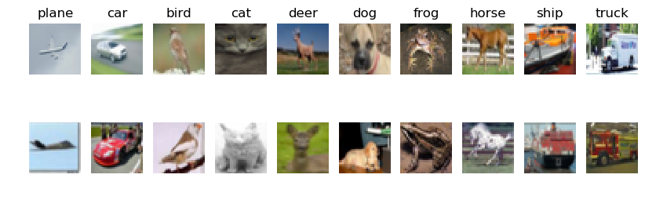

## Summary of Assignment  

Stanford CS231n Computer Vision (2022)

## Assignment 0: Python Numpy

[Python Tutorial](../MyProject22/assignment0_Python/python.ipynb)

- Jupyter and Colab Notebooks
- Python
  - Basic data types, Containers(Lists, Dictionaries, Sets, Tuples)
  - Functions
  - Classes
- Numpy
  - Arrays
  - Array indexing (**Boolean/ Integer Array Indexing**)
  - Datatypes
  - Array math
  - Broadcasting
- SciPy
  - Image operations
  - MATLAB files
  - Distance between points
- Matplotlib
  - Plotting, Subplots, Images

## Assignment 1: Neural Networks

Data-driven approach ( Train/ Predict stages)

## Image Classification Pipeline

[The CIFAR-10 dataset](http://www.cs.toronto.edu/~kriz/cifar.html)

- 32x32 resolution RGB colour images in 10 classes, with 6000 images per class. There are 50000 training images and 10000 test images.

Visualize the dataset

```
idxs = np.random.choice(idxs, samples_per_class, replace=False) 
```



```
Training data shape:  (50000, 32, 32, 3) 
# Training Images = 50000, Resolution = 32x32, RGB = 3, Class = 10.
Training labels shape:  (50000,) 
```

### k-Nearest Neighbor (kNN)

Q1 [k-Nearest Neighbor classifier](../MyProject22/assignment1/knn.ipynb)

- **Training**: take the training data (num_train, D) and simply remembers it.
- **Testing**:  classify every test image by comparing to all training images and transferring the labels of the k most similar training examples.

  - compute the distance matrix between each test point in X and each training point  shape = **$N_{te} \times N_{tr}$**
    
  - L1, L2 distances, np.linalg.norm()
  - $$
    ||X|| = \sqrt{|\sum_{i,j} x_{i,j}^2|}
    $$
  - Prediction

  ```Python
  '''For each test sample with index i''' 
     closest_y= self.y_train[np.argsort(dists[i])[:k]]
     y_pred[i]=np.argmax(np.bincount(closest_y))
  ```

  - the best value of k (hyperparameter) is *cross-validated*


## Linear Classifier: Parametric approach

Preprocessing: Reshape into single row; Normalization, center, scale; Add bias dimension term

Implement a fully-vectorized loss function, analytic gradient expression

Validation set to tune the learning rate and regularization strength

Optimize the loss function with SGD

Visualize the final learned weights

### SVM

Q2 [Training a Support Vector Machine](../MyProject22/assignment1/svm.ipynb)

Loss Function: max-margin loss

Analytic gradient: exact, fast, error-prone

Gradient Check: using easy-to-write Numerical gradient to make sure everything is right.


### Softmax

Q3 [Implement a Softmax classifier](../MyProject22/assignment1/softmax.ipynb)

Loss Function: cross-entropy

### Two-Layer Neural Network

Q4 [Two-Layer Neural Network](../MyProject22/assignment1/two_layer_net.ipynb)

## Image Features

Q5 [Higher Level Representations: Image Features](../MyProject22/assignment1/features.ipynb)
