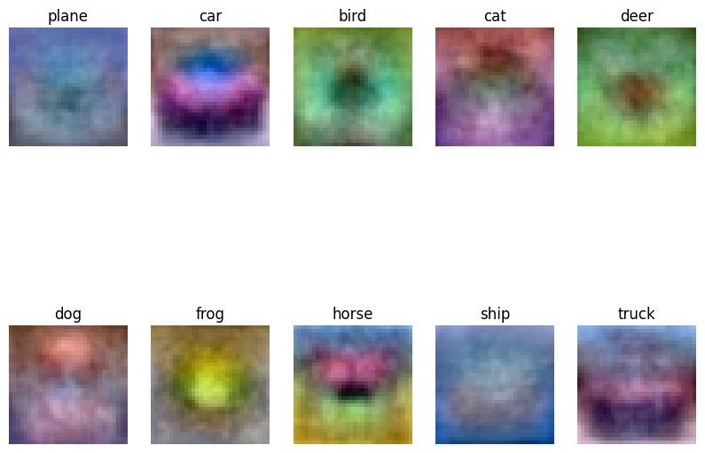

## Summary of Assignment

Stanford CS231n Computer Vision (2022)

## Assignment 0: Python Numpy

[Python Tutorial](../MyProject22/assignment0_Python/python.ipynb)

- Jupyter and Colab Notebooks
- Python
  - Basic data types, Containers(Lists, Dictionaries, Sets, Tuples)
  - Functions
  - Classes
- Numpy
  - Arrays
  - Array indexing (**Boolean/ Integer Array Indexing**)
  - Datatypes
  - Array math
  - Broadcasting
- SciPy
  - Image operations
  - MATLAB files
  - Distance between points
- Matplotlib
  - Plotting, Subplots, Images

## Assignment 1: Neural Networks

Data-driven approach ( Train/ Predict stages)

## Image Classification Pipeline

[The CIFAR-10 dataset](http://www.cs.toronto.edu/~kriz/cifar.html)

- 32x32 resolution RGB colour images in 10 classes, with 6000 images per class. There are 50000 training images and 10000 test images.

Visualize the dataset

```
idxs = np.random.choice(idxs, samples_per_class, replace=False) 
```


```
Training data shape:  (50000, 32, 32, 3) 
# Training Images = 50000, Resolution = 32x32, RGB = 3, Class = 10.
Training labels shape:  (50000,) 
```

### k-Nearest Neighbor (kNN)

Q1 [k-Nearest Neighbor classifier](../MyProject22/assignment1/knn.ipynb)

- **Training**: take the training data (num_train, D) and simply remembers it.
- **Testing**:  classify every test image by comparing to all training images and transferring the labels of the k most similar training examples.

  - compute the distance matrix between each test point in X and each training point  shape = **$N_{te} \times N_{tr}$**
    
  - L1, L2 distances, np.linalg.norm()
  - $$
    ||X|| = \sqrt{|\sum_{i,j} x_{i,j}^2|}
    $$
  - Prediction

  ```Python
  '''For each test sample with index i''' 
     closest_y= self.y_train[np.argsort(dists[i])[:k]]
     y_pred[i]=np.argmax(np.bincount(closest_y))
  ```

  - the best value of k (hyperparameter) is *cross-validated*


[kNN Online Demo](http://vision.stanford.edu/teaching/cs231n-demos/knn/)

## Linear Classifier: Parametric approach

Score function,

$y = f(x^{3072}, W^{10 \times 3072}) = W x +b  + \alpha R(W)$

[Linear Classifier](../MyProject22/assignment1/cs231n/classifiers/linear_classifier.py)

See more at Lecture 2-3 and related reading.

```
Train data shape:  (49000, 32, 32, 3)
Train labels shape:  (49000,)

Validation data shape:  (1000, 32, 32, 3)
Validation labels shape:  (1000,)
# to tune the learning rate and regularization strength

Test data shape:  (1000, 32, 32, 3)
Test labels shape:  (1000,)
```

Preprocessing

- Reshape image into flattened row  `(_,3072)`;
- Normalization, center, scale;
  - Subtract the mean image from train and test data
- Add bias dimension term one

Loss function

- fully-vectorized
- **Gradient Check**

  - Analytic gradient: exact, fast, error-prone,
  - Numerical gradient: easy-to-write but slow.
  - Using the latter to make sure everything is right.
- with regulation term

  - L1 / L2 / Elastic net (L1+L2)
- Optimize the loss function with SGD

  - SGD  / SGD+Momentum / RMSProp  / Adam

    - Adam is a good default choice in many cases; it often works ok even with constant learning rate
    - SGD+Momentum can out perform Adam but may require more tuning of LR and schedule
    - If full batch updates then try out L-BFGS (and don’t forget to disable all sources of noise)

  

  - Visualize the final learned weights

### SVM

Q2 [Training a Support Vector Machine](../MyProject22/assignment1/svm.ipynb)

Preprocessing:

- Subtract the mean image from train and test data
  - 

Loss Function: [Hinge loss](https://en.wikipedia.org/wiki/Hinge_loss) max-margin classification

The SVM “wants” the correct class for each image to a have a score higher than the incorrect classes by some fixed margin Delta = 1.

score vector $s=f(x_i,W)$

$$
L_i = \sum_{j \neq y_i} max(0, s_j -s_i +1)
$$

```
|\ Loss
| \
|   \
O _ _ 1 = = 2 = = 3.  delta_s 
		    = correct class - incorrect class 
```

Split data into train, val; choose hyperparameter on val and evaluate on test


### Softmax

Q3 [Implement a Softmax classifier](../MyProject22/assignment1/softmax.ipynb)

$$
P(Y=k |X=x_i)= \frac{exp(s_k)}{\sum_j exp(s_j)}
$$

Loss Function: [Cross-entropy](https://www.google.com/url?sa=t&rct=j&q=&esrc=s&source=web&cd=&ved=2ahUKEwjxzcKM4YWDAxXFR0EAHflmCksQFnoECBkQAQ&url=https%3A%2F%2Fen.wikipedia.org%2Fwiki%2FCross-entropy&usg=AOvVaw228IHK-lfaJa7UIBg6wMJX&opi=89978449)

$$
L_i = - log P(Y=y_i|X=x_i)
$$



## Two-Layer Neural Network

Score function,

$y = f(x^{3072}, W_1^{H \times 3072}, W_2^{10 \times H}) =W_2 \sigma(W_1x + b_1) + b_2$

Hierarchical computation $3072 \rightarrow H \rightarrow C=10$.

- Activation function $\sigma$
- Sigmoid / (Leeky) ReLU / tanh / Maxout / ReLU / ELU

See more at Lecture 4 and related reading.

Q4 [Two-Layer Neural Network](../MyProject22/assignment1/two_layer_net.ipynb)

The architecure is

affine - relu - affine - softmax.


## Image Features

Q5 [Higher Level Representations: Image Features](../MyProject22/assignment1/features.ipynb)

Color Histogram (hue channel in HSV);  Histogram of Oriented Gradients.

## Assignment 2: Further Image classification, CNN

Q1: [Multi-Layer Fully Connected Neural Networks](../MyProject22/assignment2/FullyConnectedNets.ipynb)

Extend the Neural Network to n layers.

**Optimizer** Implementation

First-order method

- Vanilla SGD

```python
# Vanilla update
x += - learning_rate * dx
```

- SGD + Momentum

```python
# Momentum update
v = mu * v - learning_rate * dx # integrate velocity
x += v # integrate position
```

- Nesterov Momentum

```python
x_ahead = x + mu * v
# evaluate dx_ahead (the gradient at x_ahead instead of at x)
v = mu * v - learning_rate * dx_ahead
x += v
```

Second-order methods

Adaptive learning rate methods

- RMSProp

```python
cache = decay_rate * cache + (1 - decay_rate) * dx**2
x += - learning_rate * dx / (np.sqrt(cache) + eps)
```

- Adam

```python
# t is your iteration counter going from 1 to infinity
m = beta1*m + (1-beta1)*dx
# mt = m / (1-beta1**t)
v = beta2*v + (1-beta2)*(dx**2)
# vt = v / (1-beta2**t)
x += - learning_rate * mt / (np.sqrt(vt) + eps)
```

Q2: [Batch Normalization](../MyProject22/assignment2/BatchNormalization.ipynb)

Q3: [Dropout](../MyProject22/assignment2/Dropout.ipynb)

Q4: [Convolutional Neural Networks](../MyProject22/assignment2/ConvolutionalNetworks.ipynb)

Q5: [PyTorch on CIFAR-10](../MyProject22/assignment2/PyTorch.ipynb)

Q6: [Network Visualization: Saliency Maps, Class Visualization, and Fooling Images](../MyProject22/assignment2/Network_Visualization.ipynb)

## Assignment 3: Image Captioning, GAN, Transformer, LSTM

Q1: [Image Captioning with Vanilla RNNs](../MyProject22/assignment3/RNN_Captioning.ipynb)

Q2: [Image Captioning with Transformers](../MyProject22/assignment3/Transformer_Captioning.ipynb)

Q3: [Generative Adversarial Networks](../MyProject22/assignment3/Generative_Adversarial_Networks.ipynb)

Q4: [Self-Supervised Learning for Image Classification](../MyProject22/assignment3/Self_Supervised_Learning.ipynb)

Extra Credit: [Image Captioning with LSTMs](../MyProject22/assignment3/LSTM_Captioning.ipynb)
