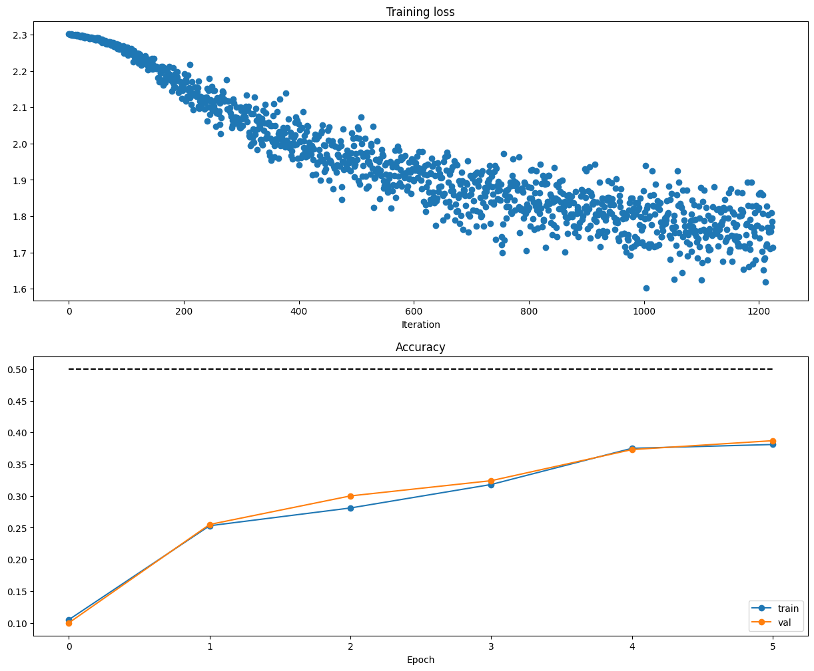

# Deep Learning for Computer Vision [Stanford CS231n]

## Course Website

Deep Learning for CV [Stanford CS231n]

[latest](http://cs231n.stanford.edu/), [2022](http://cs231n.stanford.edu/2022/), [16-17 (CS131 CV: Foundations and Applications)](http://vision.stanford.edu/teaching/cs131_fall1617/schedule.html)

## Project introduction

### Setup

*Environment*

- [Google Colab](https://colab.google/)
  - call deployColab( ), see more at Colab Tutorial from CS231n.
- Local PC (without GPU is fine in general)
  - Dependency: Python3.9
  - [Setup.sh](./MyProject22/Setup.sh)

*Dataset* ``cs231n/datasets`` run the shell to download files.

### Details and Note

[Assignments (2022) Implementation Details and Note](Doc/Assignment22.md)

- Image Classification + Localization $(x,y,w,h)$
- Object Detection
  - Variable numbers of output, sliding window
- Semantic / Instance Segmentation
- Image Captioning

### Overview

Visualize the [CIFAR-10 dataset](http://www.cs.toronto.edu/~kriz/cifar.html)

```
idxs = np.random.choice(idxs, samples_per_class, replace=False) 
```


- Image Classification (Supervised Learning, Discrete label)

  * kNN
    * 
  * Softmax
  * Multi-class SVM
  * MLP
  * CNN
  * Cross Validation
- Cross Validation for hyperparameter

  - Split data into train, val; choose hyperparameters on val and evaluate on test


*Two-Layer Neural Network architecure*: affine - relu - affine - softmax.




- [Batch/Layer Normalization](./MyProject22/assignment2/BatchNormalization.ipynb)
- [Dropout](./MyProject22/assignment2/Dropout.ipynb)
- [Convolutional Neural Networks](./MyProject22/assignment2/ConvolutionalNetworks.ipynb)

**Convolution, Max Pool, Normalization**

- [PyTorch on CIFAR-10](./MyProject22/assignment2/PyTorch.ipynb)
- [Network Visualization: Saliency Maps, Class Visualization, and Fooling Images](./MyProject22/assignment2/Network_Visualization.ipynb)


### See more:

[Assignments (2022) Implementation Details and Note](Doc/Assignment22.md)

## Machine Learning Knowledge Sharing

See more [ML_Guidance_Repo](https://github.com/PeterHUistyping/Machine_Learning_Guidance) about Machine Learning and Data Science in general
