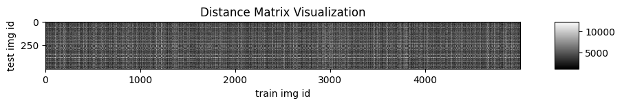

# Stanford_CS231n-Deep_Learning-for-Computer_Vision

## Course Website

[CS231n: Deep Learning for CV latest](http://cs231n.stanford.edu/)
[CS231n: Deep Learning for CV 2022](http://cs231n.stanford.edu/2022/)

[CS131 CV: Foundations and Applications 16-17](http://vision.stanford.edu/teaching/cs131_fall1617/schedule.html)

## Project introduction

2022 CS231n Assignments1-3 [Details and Note](Doc/Assignment-2022.md)

Visualize the [CIFAR-10 dataset](http://www.cs.toronto.edu/~kriz/cifar.html)

```
idxs = np.random.choice(idxs, samples_per_class, replace=False) 
```


- Image Classification (Supervised Learning, Discrete label)

  * kNN
    * 
  * Softmax
  * Multi-class SVM
  * MLP
  * CNN
  * Cross Validation
- Cross Validation for hyperparameter

  - Split data into train, val; choose hyperparameters on val and evaluate on test


*Two-Layer Neural Network architecure*: affine - relu - affine - softmax.


## Machine Learning Knowledge Sharing

See more [ML_Guidance_Repo](https://github.com/PeterHUistyping/Machine_Learning_Guidance) about Machine Learning and Data Science in general
